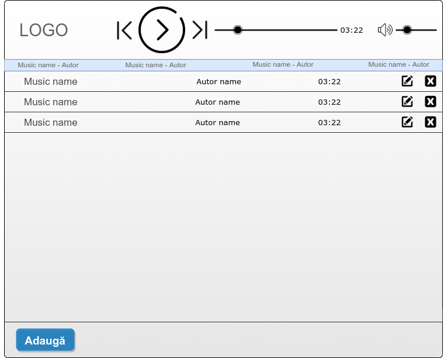
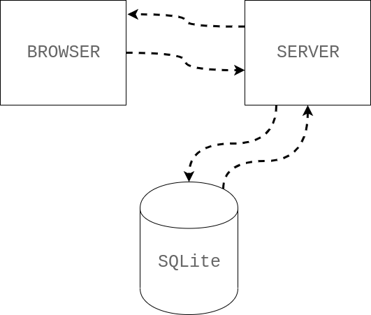
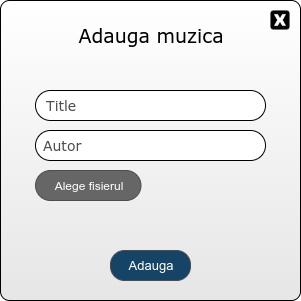
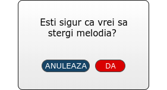
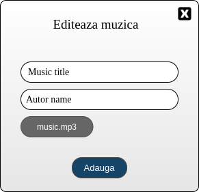

TODOs:

- Ajustarea design să conțină titlul piesei curente
- Formulă calculare durată

# Design Doc

**Design**
-----------------



Pe prima pagina vom avea:
* logo-ul aplicatiei
* player-ul audio
* Inputurile cu muzica
* doua butoane in partea stanga prin care putem edita si sterge muzica
* un buton jos prin care se va putea incarca muzica

**Model arhitectural**
----------------------



* Serverul va fi creat in Python.
* Frontentul va fi creat in HTML si CSS.
* Vom folosi a baza de date SQLite.

**API - Server**
----------------

* cand apasam pe butonul _adauga_ ne va aparea un pop-up cu un formular.
```
playload: {title: value
           autor: value
           file: value.mp3}
```
* Butonul de adugat va merge pe ruta **/audio/adauga**  metoda **POST**.



* Butonul de stergere va afisa un pop-up care ne va intreba daca suntem siguri ca vrem sa stergem muzica.

* Butonul de stergere va merge pe ruta **/audio/delete/{id}** metoda **DELETE**



* Butonul de editeaza ne va afisa formularul cu titlu si autorul muzici.



* 
**/audio/PUT/{id}** - va face un request pe metoda de PUT


```
playload: {title: music name
           autor: autor name
           file: music.mp3}
```


Link-uri utile:
---------------

- [HTTP/REST API File Uploads](https://phil.tech/api/2016/01/04/http-rest-api-file-uploads/)