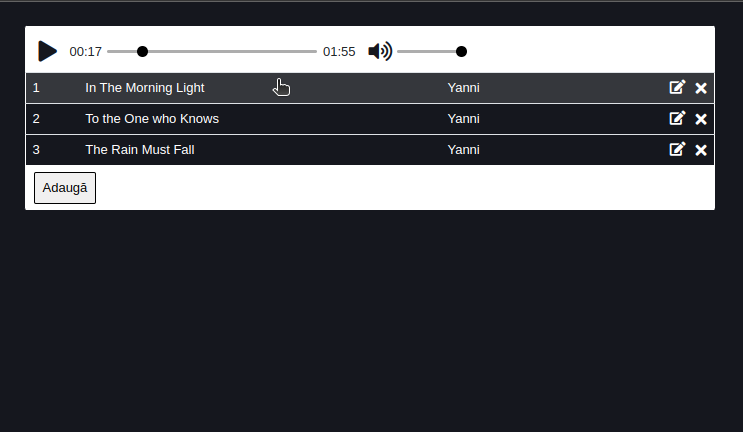
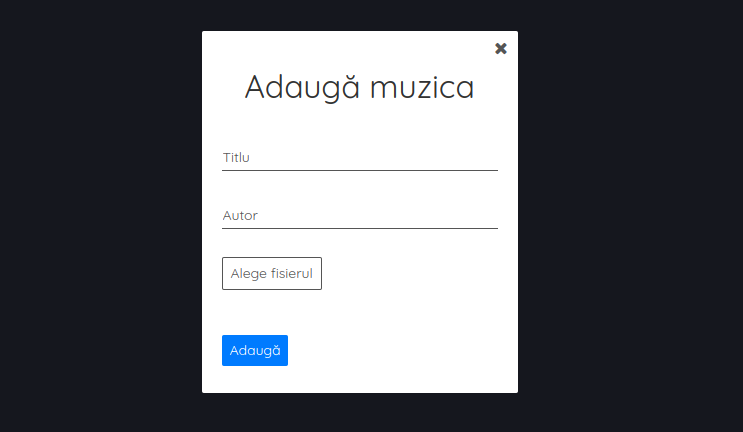
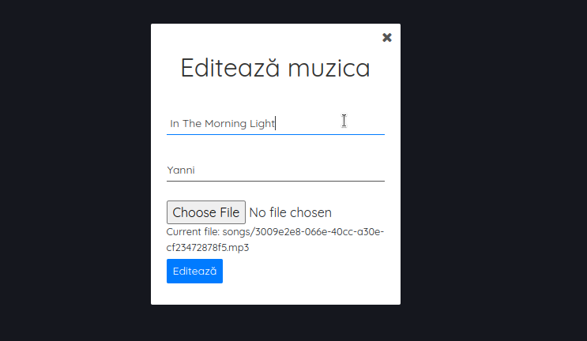
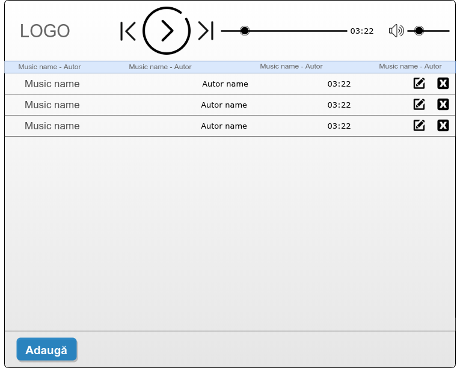
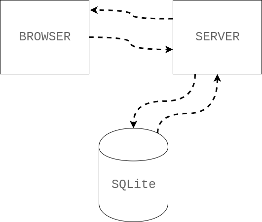
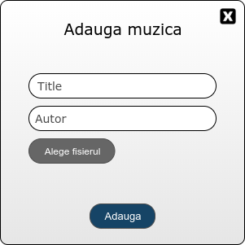
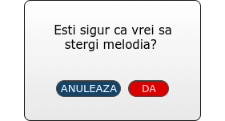
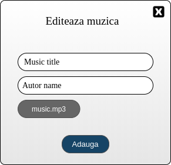

# Music Player

A web-based music player application built using HTML, CSS, JavaScript, and Flask. This project allows users to upload, play, and manage audio files seamlessly.

> Note: The original repository for this project was hosted on a private repository within an organization. Unfortunately, access to the original repository was lost, which led to the creation of this new repository. This repository continues the development and maintenance of the application from where the previous one left off.


## Table of Contents

- [Features](#features)
- [Screenshots](#screenshots)
- [Installation](#installation)
- [Usage](#usage)
- [API Documentation](#api-documentation)
- [Notes](#notes)
<!-- - [Contributing](#contributing)
- [License](#license)
- [Contact Information](#contact-information) -->

## Features

- Play, pause audio tracks with intuitive controls.
- Volume control and mute functionality for a personalized listening experience.
- Upload, edit, and delete audio files directly through the interface.

## Screenshots




## Installation

To set up the project locally, follow these steps:

1. **Clone the repository:**
   ```bash
    git clone git@github.com:robert-oros/music-player.git
    cd music-player
   ```

2. **Set up a virtual environment and activate it:**
    ```bash
    python3 -m venv venv
    source venv/bin/activate # On Windows use `venv\Scripts\activate`
    ```

3. **Install the required dependencies:**
    ```bash
    pip3 install -r requirements.txt
    ```
4. **Initialize MySQL database**
    ```bash
    make mysql
    ```
5. **Run the Flask application:**
    ```bash
    python3 main.py
    ```

6. **Open your browser and go to:**
    ```bash
    http://127.0.0.1:8000/audio
    ```

## Usage

1. **Uploading Audio Files:**
    - Click the "Adaugă" button to upload new audio files.

2. **Playing Audio Files:**
    - Click the play button to start the audio.
    - Use the slider to seek through the track.
    - Adjust the volume or mute the audio as needed.

3. **Managing Audio Files:**
    - Delete audio files using the provided links in the table.
    - Edit functionality.

4. **Current Song Display:**
    - Displaying the current song is under development.

## API Documentation

The music player application exposes a set of HTTP endpoints for interacting with audio files stored in a database. Below is a detailed description of each endpoint, including its URL, methods, parameters, and response details.

### Endpoints

#### 1. Serve JavaScript and CSS

- `GET /audio/js/<path>`

  - **Description:** Serves JavaScript files from the `js` directory.
  - **Path Parameters:**
    - `path` (string): The path to the JavaScript file to be served.
  - **Response:** The requested JavaScript file.

- `GET /audio/css/<path>`

  - **Description:** Serves CSS files from the `css` directory.
  - **Path Parameters:**
    - `path` (string): The path to the CSS file to be served.
  - **Response:** The requested CSS file.

#### 2. Home Page

- `GET /audio/`

  - **Description:** Renders the home page displaying all audio files from the database.
  - **Response:** HTML page with a list of audio files.
  - **Errors:** 
    - Returns a `500` error with a message if there is an issue fetching data from the database.

#### 3. Add New Audio

- `GET /audio/add`

  - **Description:** Renders a form for adding a new audio file.
  - **Response:** HTML page with a form to upload audio.

- `POST /audio/add`

  - **Description:** Adds a new audio file to the database.
  - **Request Body:**
    - `title` (string): The title of the audio track.
    - `autor` (string): The author of the audio track.
    - `file` (file): The audio file to be uploaded.
  - **Response:** Redirects to `/audio/` on success.
  - **Errors:**
    - Returns a `400` error if title, author, or file is missing.
    - Returns a `500` error if there is an issue saving the file or inserting the record into the database.

#### 4. Delete Audio
- `DELETE /audio/delete`

  - **Description:** Deletes an audio file from the database based on the provided ID.
  - **Query Parameters:**
    - `id` (string): The ID of the audio track to delete.
  - **Response:** JSON message indicating success.
  - **Errors:**
    - Returns a `400` error if the `id` parameter is missing.
    - Returns a `500` error if there is an issue deleting the record.

#### 5. Edit Audio

- `GET /audio/edit`

  - **Description:** Renders a form to edit an existing audio file's details.
  - **Query Parameters:**
    - `id` (string): The ID of the audio track to edit.
  - **Response:** HTML page with a form pre-filled with the current audio details.
  - **Errors:**
    - Returns a `500` error if there is an issue fetching the record.

- `POST /audio/edit`

  - **Description:** Updates an existing audio file's details in the database.
  - **Request Body:**
    - `title` (string): The new title of the audio track.
    - `autor` (string): The new author of the audio track.
    - `file` (file): The new audio file to upload (optional).
  - **Response:** Redirects to `/audio/` on success.
  - **Errors:**
    - Returns a `500` error if there is an issue updating the record.

### Database Schema

The application uses a database table named `mp3player` with the following schema:

- **id** (INT, Primary Key): The unique identifier for each audio track.
- **title** (VARCHAR): The title of the audio track.
- **autor** (VARCHAR): The author of the audio track.
- **audio_path** (VARCHAR): The file path of the uploaded audio file.

### Error Handling

The application returns appropriate HTTP status codes along with error messages when requests fail due to missing parameters or database errors.

### Environment Variables

The application can be configured using the following environment variables:

- `MYSQL_HOST`: The hostname of the MySQL server (default: `localhost`).
- `MYSQL_USER`: The username for MySQL authentication (default: `root`).
- `MYSQL_PASSWORD`: The password for MySQL authentication (default: `pass`).
- `MYSQL_DATABASE`: The name of the MySQL database (default: `mydb`).
- `MYSQL_PORT`: The port number for the MySQL server (default: `3306`).

Ensure you have a `.env` file set up with these variables if you want to customize the database connection.

### Notes

> **Highlight Incomplete Features:** Clearly indicate that the functionality for displaying the current song, is not yet complete and is under development.


<!-- 

**Design**
-----------------



Pe prima pagina vom avea:
* logo-ul aplicatiei
* player-ul audio
* Inputurile cu muzica
* doua butoane in partea stanga prin care putem edita si sterge muzica
* un buton jos prin care se va putea incarca muzica

**Model arhitectural**
----------------------



* Serverul va fi creat in Python.
* Frontentul va fi creat in HTML si CSS.
* Vom folosi a baza de date SQLite.

**API - Server**
----------------

* cand apasam pe butonul _adauga_ ne va aparea un pop-up cu un formular.
```
playload: {title: value
           autor: value
           file: value.mp3}
```
* Butonul de adugat va merge pe ruta **/audio/adauga**  metoda **POST**.



* Butonul de stergere va afisa un pop-up care ne va intreba daca suntem siguri ca vrem sa stergem muzica.

* Butonul de stergere va merge pe ruta **/audio/delete/{id}** metoda **DELETE**



* Butonul de editeaza ne va afisa formularul cu titlu si autorul muzici.



* 
**/audio/PUT/{id}** - va face un request pe metoda de PUT


```
playload: {title: music name
           autor: autor name
           file: music.mp3}
```


Link-uri utile:
---------------

- [HTTP/REST API File Uploads](https://phil.tech/api/2016/01/04/http-rest-api-file-uploads/) -->